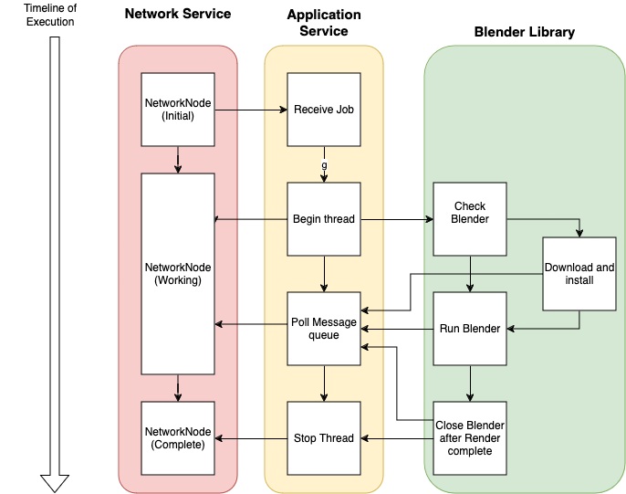

# BlendFarm

## An Open Source, Decenterialized Network Render Farm Application

This project is inspired by the original project - [LogicReinc](https://github.com/LogicReinc/LogicReinc.BlendFarm)

# A Word from Developer:
This is still a experimental program I'm working on. If you find bugs or problem with this tool, please do not heistate to create an issue, I will review them when I get to the next milestone step. 

### Why I created this application:

Learning 3D animation back in college, there exist a priorietary application used by Autodesk that allows network rendering possible on school computer called [Autodesk Backburner](https://apps.autodesk.com/en/Detail/Index?id=3481100546473279788&appLang=en&os=Linux) that came with Autodesk foundation that saved me many hours of rendering shots for my school projects. When Blender soar through popularity among the community and industry, I shifted my focus to use Blender 3D tool instead of using Autodesk 3ds Max and Maya. It wasn't until I realized that Blender, out of the box, does not have any network rendering solution similar to Autodesk backburner, I realize this was the piece that is still missing from this amazing open-source, industry leading, software tool. Digging through online, there are few tools out there that provides "good enough", but I felt like there's so much potential waiting to be tapped into that unlocks the powertrain to speed development all the way to production velocity by utilizing network resources.
I humbly present you BlendFarm 2.0, a open-source software completely re-written in Rust from scratch with memory safety in mind, simplified UI for artist friendly, and easy to setup by launching the application with minimal to no experience required. Thanks to Tauri library, the use of this tool comes into three separate parts - 

## Library usage:
[Tauri](https://v2.tauri.app) - Frontend UI interface for the application, as well as Rust backend service that glue all of the API together.

[libp2p](https://docs.libp2p.io/) - Peer 2 Peer decenteralize network service that enables network discovery service (mDNS), communication (gossipsub), and file share (kad/DHT).

Blender - Custom library I wrote that acts as a blender CLI wrapper to install, invoke, and launch blender 3d.

[Blend](https://docs.rs/blend/latest/blend/) - Used to read blender file without blender application to enable extracting information to the user with pre-configured setup (Eevee/Cycle, frame range, Cameras, resolution, last blender version used, etc).

## Network Infrastructure

The overall level of how the network works can be seen below:

 <!-- TODO: Explain how the node will receive a particular frame to render on? -->
The GUI will submit a gossip message to all of the connected render node, having the blend file available to download. The node will then kick off a background task to handle the job process. This will interface with the blender library to check for the blender installation. If the node doesn't have the proper blender version, it will ask other peers on the network for matching blender version to reduce network traffic from the internet. Afterward, the blender library will invoke the command to start the job. The library outputs status to provide back to the host for real time updates and progress check. Once Blender is completed with the render, the application will receive the notification and publish the completed render image for the host to obtain the image.

## GUI 
For new users and anyone who wants to get things done quickly. Simply run the application. When you run the app on computers that will be used as a rendering farm, simply navigate to the app and run as client instead. This will minimize the app into a service application, and under the traybar, you can monitor and check your render progress. To launch the GUI interface from source - simply run from BlendFarm/ directory `cargo tauri dev` to run in development mode or `cargo run build` for production lightweight shippable mode.

## CLI 
For those who wish to run the tools on headless server and network farm solution, this tool provide ease of comfort to setup, robust dialogs and information, and thread safety throughout application lifespan. To launch the application as a client mode simply run the following command inside src-tauri/ directory:
`cargo run -- client`

<!-- TOOD: For future impl. WE won't have to worry about this for this sprint milestone for now. ## Library
.rlib are publicly available and exposed by compiling rust into the library bundle. You can compile the blender package separately and use the codebase to allow your program to interface blender. Or interface to the manager of the toolchain to help prebuild your assembly with out of box template to interface with blender program.    -->

# Planned
[ ] Pipe Blender's rendering preview
[ ] Node version distribution - to reduce internet traffic to download version from source.
[ ] File distribution for Blender version for other node to reduce INternet download traffic using DHT/Provider service from Kademila/libp2p

# Limitations
Blender's limitation applies to this project's scope limitation. If a feature is available, or compatibility to run blender on specific platform - this tool will need to reflect and handle those unique situation. Otherwise, this tool follows Blender's programming guideline to ensure backward compatibility for all version available.

## Getting Started

There are several ways to start; the first and easiest would be to download the files and simply run the executable, the second way is to download the source code and compile on your computer to run and start.

### TLDR:

First and foremost - this commands may be subject to change in the future. (Need to find a better way to handle Clap subcommand with tauri's cli plugin - for now, I'm treating it as an argument)

First - Install tauri-cli as this component is needed to run `cargo tauri` command. Run the following command:
`cargo install tauri-cli --version ^2.0.0-rc --locked`

*Note- For windows, you must encapsulate the version in double quotes!

To run Tauri app - run the following command under `/BlendFarm/` directory - `cargo tauri dev`

To run the client app - run the following command under `/BlendFarm/src-tauri/` directory - `cargo run -- client`

### Network:

Under the hood, this program uses libp2p with [QUIC transport](https://docs.libp2p.io/concepts/transports/quic/). This act this computer as both a server and a client. Wrapped in a containerized struct, I am using [mdns](https://docs.libp2p.io/concepts/discovery-routing/mdns/) for network discovery service (to find other network farm node on the network so that you don't have to connect manually), [gossipsub]() for private message procedure call ( Basically how node interacts with other nodes), and kad for file transfer protocol (how node distribute blend, image, and blender binary files across the network). With the power of trio combined, it is the perfect solution for making network farm accessible, easy to start up, and robost. Have a read into [libp2p](https://libp2p.io/) if this interest your project needs! 

<!-- Hidden from view for developer remarks
    Testing out peer 2 peer over two linux box. One of the machine hasn't been update/upgrade in awhile, but reported an issue about missing PKG_CONFIG_ALLOW_SYSTEM_CFLAGS=1 pkg_config --libs --cflags glib-2.0 glib-2.0 - the pkg-config command could not be found. Install via apt install pkg-config resolve this one problem, but more likely you need to preconfigure PKG_CONFIG_PATH in environment variable.
 -->