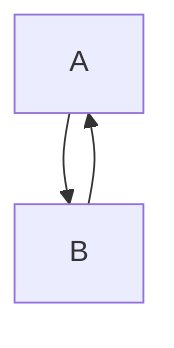

The application can be start up in two ways. One through a GUI interface, which launches the manager. The manager sole responsibility is to provide blender file and task associated with to distribute across network nodes. The other mode is the client, which is treated as a worker to receive the task and begin the work process. 

How it establish connections across the network, the manager broadcast availability through UDP broadcast upon start, then listen for responses. The client will receive the response from the UDP only if the client is exhausted of remaining tasks. However, the client may advertise it's availability to present awareness to the manager. This settings is configurable within the app configuration file. This documentation is created to clarify the design application flow processes looks like. The visual representation below represent the schematic code diagram.

